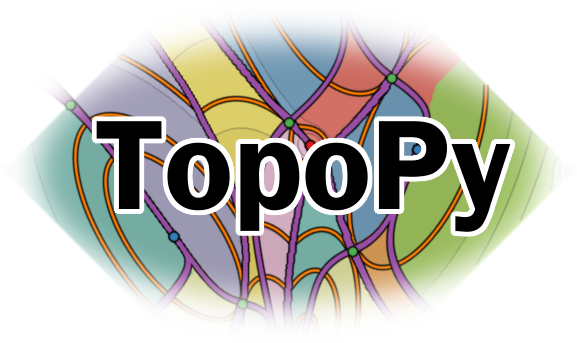

topopy
======

.. badges

.. image:: https://img.shields.io/pypi/v/topopy.svg
        :target: https://pypi.python.org/pypi/topopy
        :alt: Latest Version on PyPI
.. image:: https://img.shields.io/pypi/dm/topopy.svg?label=PyPI%20downloads
        :target: https://pypi.org/project/topopy/
        :alt: PyPI downloads

.. image:: https://github.com/maljovec/topopy/actions/workflows/quality.yaml/badge.svg?branch=main
        :target: https://github.com/maljovec/topopy/actions
        :alt: Code Quality Test Results
.. image:: https://github.com/maljovec/topopy/actions/workflows/test.yaml/badge.svg?branch=main
        :target: https://github.com/maljovec/topopy/actions
        :alt: Test Suite Results

.. image:: https://www.codefactor.io/repository/github/maljovec/topopy/badge
        :target: https://www.codefactor.io/repository/github/maljovec/topopy
        :alt: CodeFactor
.. image:: https://coveralls.io/repos/github/maljovec/topopy/badge.svg?branch=main
        :target: https://coveralls.io/github/maljovec/topopy?branch=main
        :alt: Coveralls
.. image:: https://readthedocs.org/projects/topopy/badge/?version=latest
        :target: https://topopy.readthedocs.io/en/latest/?badge=latest
        :alt: ReadTheDocs
.. image:: https://pyup.io/repos/github/maljovec/topopy/shield.svg
        :target: https://pyup.io/repos/github/maljovec/topopy/
        :alt: Pyup

.. image:: https://img.shields.io/badge/code%20style-black-000000.svg
        :target: https://github.com/psf/black
        :alt: This code is formatted in black
.. image:: https://img.shields.io/badge/License-BSD_3--Clause-blue.svg
        :target: https://opensource.org/licenses/BSD-3-Clause
        :alt: BSD 3-Clause License

.. end_badges

.. logo

.. end_logo

.. introduction

A library for computing topological data structures stemming from Morse Theory. Given a set of arbitrarily arranged points in any dimension, this library is able to construct approximate topological structures using a neighborhood graph to simulate manifold structures.

.. end_introduction

.. installation

Installation
~~~~~~~~~~~~

Currently, you can use pip_ to install this package
and all of its prerequisite libraries::

    pip install topopy

.. _pip: https://pip.pypa.io/en/stable/

Or to install from source, install all of the prerequiste libraries:

* scipy_
* numpy_
* scikit-learn_
* networkx_
* nglpy_

.. _scipy: https://www.scipy.org/
.. _numpy: http://www.numpy.org/
.. _scikit-learn: http://scikit-learn.org/)
.. _networkx: https://networkx.github.io/
.. _nglpy: https://github.com/maljovec/nglpy

And then clone and build the source repository::

    git clone https://github.com/maljovec/topopy.git
    cd topopy
    make
    python setup.py [develop|install]

.. end_installation

.. usage

Example Usage
~~~~~~~~~~~~~

::

    import nglpy as ngl
    import numpy as np
    import topopy

    def hill(_x):
        _x = np.atleast_2d(_x)
        x = _x[:, 0]
        y = _x[:, 1]
        return np.exp(- ((x - .55)**2 + (y-.75)**2)/.125) + 0.01*(x+y)

    X = np.random.rand(100,2)
    Y = hill(X)
    graph = ngl.EmptyRegionGraph(beta=1.0, relaxed=False, p=2.0)

    msc = topopy.MorseSmaleComplex(graph=graph,
                                   gradient='steepest',
                                   normalization='feature')
    msc.build(X, Y)
    msc.get_partitions()

.. end_usage
